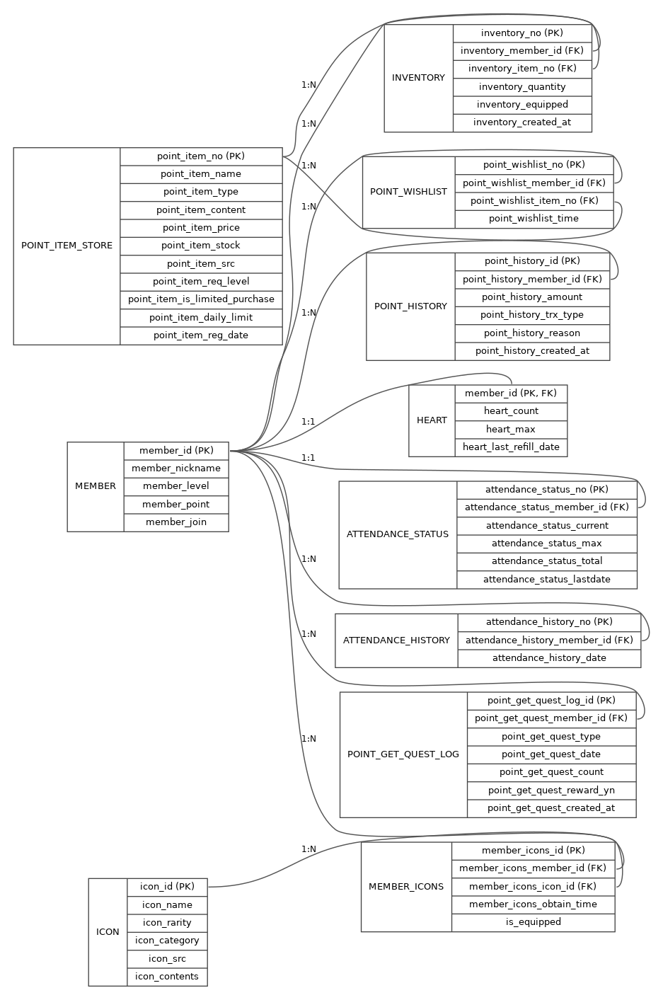
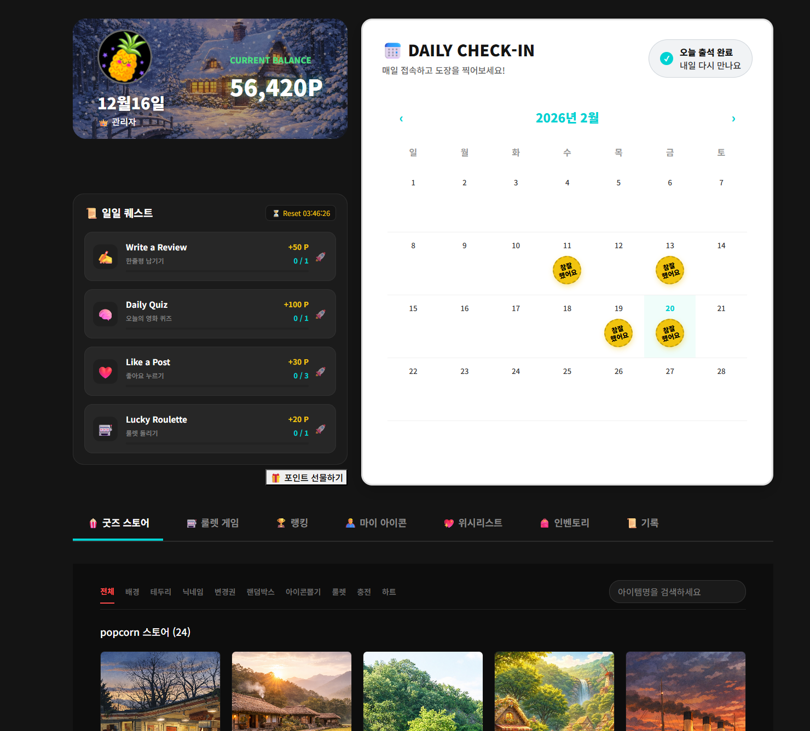

# Review Tag | Frontend

Review Tag는 영화와 다양한 콘텐츠에 대한 리뷰를 한곳에서 즐길 수 있는 플랫폼입니다. 리뷰 작성, 별점 부여, 가격 평가뿐만 아니라 퀴즈와 포인트 적립 기능까지 하나의 서비스 안에 자연스럽게 녹여낸 팀 프로젝트였습니다.

저는 프론트엔드 파트에서 주로 포인트 관련 화면을 담당했습니다. 단순히 출석, 일일 퀘스트, 상점, 인벤토리, 아이콘, 이력, 관리자 화면을 각각 따로 구현하기보다는, 이 모든 기능들이 끊김 없이 하나의 흐름으로 이어질 수 있도록 사용자 경험에 특히 신경을 썼습니다. 이를 통해 이용자가 마치 게임을 하듯 자연스럽게 포인트를 적립하고 사용할 수 있는 몰입감 있는 인터페이스를 제공하고자 노력했습니다.

---

## 프로젝트 소개

- 영화와 콘텐츠 리뷰뿐만 아니라, 가격 평가까지 한 번에 다룰 수 있는 서비스를 기획했습니다.  
- 사용자의 다양한 활동이 단순히 정보 제공에 그치지 않고, 포인트를 적립하거나 실제 소비 경험과 자연스럽게 연결될 수 있도록 구조를 설계하였습니다.  
- 로그인한 사용자에게는 출석 체크, 퀘스트, 상점, 인벤토리, 아이콘, 활동 이력, 랭킹 등 여러 기능을 제공하여, 서비스 이용의 재미와 몰입감을 높였습니다.

---

## 담당 역할

- 포인트 메인 화면과 하위 탭 구성
- 출석 체크 / 출석 캘린더 연결
- 일일 퀘스트, 룰렛, 포인트 선물하기 연동
- 상점, 위시리스트, 인벤토리, 아이콘, 이력 화면 구현
- 관리자 포인트, 상품, 자산 화면 연동
- 프로젝트 공통 axios / Jotai 구조를 기준으로 포인트 화면 갱신 흐름 정리

---

## 사용 기술

- React, Vite
- React Router
- Axios
- Jotai
- Git, GitHub

---

## 구현하면서 신경 쓴 점

- 출석이나 구매, 아이템 사용 후에도 다른 탭에서 바로 결과가 반영될 수 있도록 전체 과정을 정비했습니다.  
- 상점에서는 단순히 상품 목록만 보여주는 것이 아니라, 현재 보유 중인 상품과 위시리스트 상태도 한눈에 확인할 수 있도록 개선했습니다.  
- 기존 프로젝트 내 공통 인증 구조를 토대로, 포인트 화면의 요청 방식과 데이터 갱신 기준을 일치시켜 일관성을 높였습니다.  
- 관리자 화면 역시 사용자 화면과 전혀 다른 흐름으로 나누지 않고, 동일한 기준 안에서 자연스럽게 연동하였습니다.

---

## 구조 및 설계 문서

| 문서 | 설명 |
|---|---|
|  | 포인트 화면의 주요 컴포넌트와 공통 상태가 어떻게 연결되어 있는지 한눈에 정리한 구조도입니다. |
|  | 포인트, 인벤토리, 위시리스트, 아이콘, 이력 테이블이 서로 어떤 관계를 맺고 동작하는지 보여주는 ERD입니다. |

---

## 대표 화면

| 화면 | 설명 |
|---|---|
|  | 포인트 화면의 진입점입니다. 프로필 카드부터 출석, 퀘스트, 그리고 하단 탭까지 한눈에 흐름이 이어지도록 배치해 사용자 경험을 자연스럽게 구성했습니다. |
|  | 상점에서는 아이템 목록과 함께 현재 보유한 상태, 위시에 담긴 여부를 동시에 확인할 수 있습니다. 구매 즉시 변화가 화면에 반영되어, 사용자가 직접적인 변화를 바로 느낄 수 있도록 설계했습니다. |
|  | 아이템의 종류에 따라 사용 방식이 달라질 수 있어, 아이템을 사용한 뒤 결과가 카드뿐만 아니라 다른 탭에서도 한눈에 확인되도록 상호 연결성을 높였습니다. |
|  | 운영자가 포인트를 조정할 때, 관리자 화면에서의 변화가 실제 사용자 화면과 일치하여 혼란이 없도록 세심하게 연동하였습니다. |
---

## 관련 문서

- [프론트 상세 정리](docs/detail-front.md)
- [아키텍처 다이어그램](docs/diagrams/architecture.png)
- [ERD](docs/diagrams/erd.png)
- [화면 상세 설명](docs/screenshot/README.md)

상세 문서에는 직접 화면을 캡처해 첨부했고, PointMain.jsx, StoreView.jsx, InventoryView.jsx, StoreProfile.jsx와 같은 대표적인 파일들을 중심으로 제가 맡았던 업무의 전체적인 흐름과 트러블슈팅 과정을 단계별로 꼼꼼하게 정리해두었습니다. 실제로 어떤 문제를 어떻게 해결했는지, 그 과정에서 어떤 점을 중점적으로 고민했는지도 구체적으로 기록하여, 제 업무 이해도와 해결 역량을 객관적으로 보여주고자 노력했습니다.