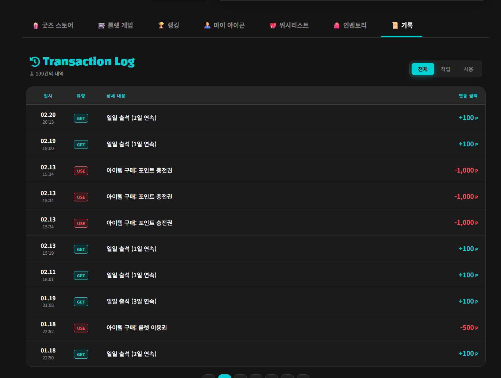
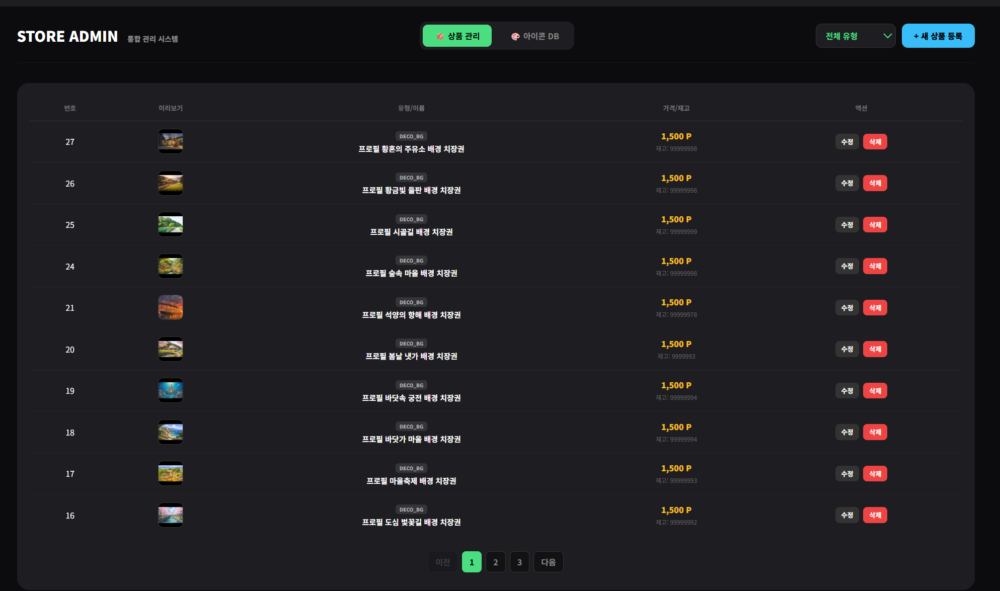
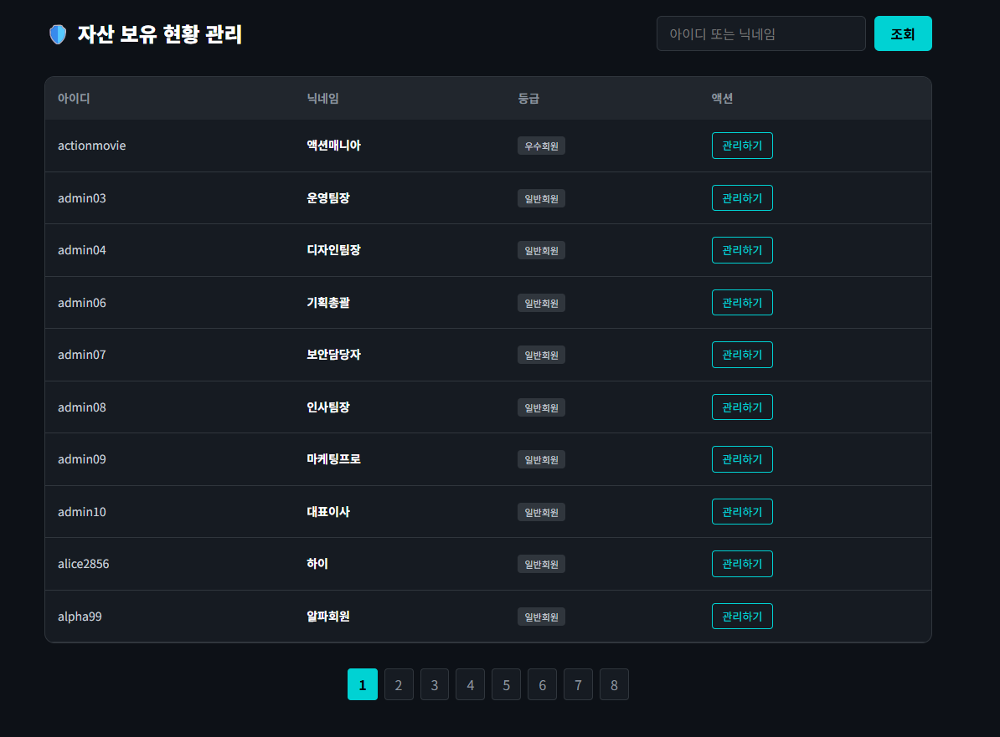

# 🎯 REVIEW TAG - 프론트엔드 

영화와 애니 리뷰 서비스 안에서 사용자의 참여가 자연스럽게 이어지도록,
포인트를 중심으로 한 생태계 흐름을 프론트엔드에서 구현한 프로젝트입니다.

출석 체크, 일일 퀘스트, 데일리 퀴즈, 룰렛, 포인트 상점, 위시리스트, 인벤토리, 포인트 이력까지
사용자가 포인트를 모으고 쓰는 흐름이 한 번에 이어지도록 화면을 구성했습니다.
관리자 화면에서는 포인트 조정, 상품 관리, 회원 자산 조회 같은 운영 기능도 함께 다뤘습니다.

> 출석 → 보상 획득 → 상점 이용 → 인벤토리 반영 → 포인트 이력 확인

---

## 프로젝트 소개

- **프로젝트명**: REVIEW TAG
- **담당 영역**: 포인트 생태계 관련 사용자 화면 및 관리자 운영 화면 구현
- **구현 목표**: 보상 기능이 많아도 사용자가 복잡하게 느끼지 않도록, 흐름이 끊기지 않는 화면과 상태 관리 구조 만들기

프론트에서 중점적으로 구현한 범위는 아래와 같습니다.

- 출석 상태 조회, 출석 체크, 출석 달력
- 일일 퀘스트 목록, 진행도 반영, 보상 수령
- 데일리 퀴즈, 룰렛 보상 흐름
- 포인트 상점, 검색 / 필터 / 페이징
- 구매, 선물하기, 위시리스트
- 인벤토리 조회, 사용, 장착, 해제, 환불
- 포인트 이력 조회
- 관리자 포인트 조정, 상품 관리, 자산 조회

---

## 기술 스택 및 협업 도구

- ⚙️ **Frontend**: React (Vite)
- 🧭 **Routing**: React Router
- 🌐 **API Communication**: Axios
- 🧩 **State Management**: Jotai
- 🔐 **Authentication**: JWT
- 🤝 **Collaboration**: Git, GitHub

인증 처리는 Axios interceptor에서 일원화했고,
포인트·재고·인벤토리처럼 정합성이 중요한 값은 성공 후 재조회하는 방식으로 화면 상태를 맞췄습니다.

---

## 실행 방법

```bash
npm install
npm run dev
```

환경 변수는 아래처럼 설정합니다.

```bash
VITE_BASE_URL=http://localhost:8080
```

---

## 프론트에서 중요하게 본 점

### 1) 인증 흐름을 한 곳에서 관리
페이지마다 인증 예외 처리를 따로 두기보다,
Axios instance와 interceptor를 기준으로 토큰 주입과 401 재요청을 공통 처리했습니다.

### 2) 화면보다 상태 동기화를 더 중요하게 봄
포인트, 재고, 인벤토리, 퀘스트 보상은 사용자가 바로 체감하는 데이터라서
성공 응답 이후 필요한 값을 다시 조회해 화면을 확정하는 방식으로 정리했습니다.

### 3) 기능이 많아도 사용자 입장에서는 한 흐름처럼 보이게 구성
출석, 퀴즈, 룰렛, 상점, 인벤토리가 각각 따로 노는 기능이 아니라
"포인트를 모으고 쓰는 흐름"으로 연결되도록 화면 구조와 갱신 타이밍을 맞췄습니다.

---

## 아키텍처

| Architecture |
|---|
|  |

프론트는 React 기반으로 화면을 구성하고,
백엔드 API와 통신하면서 사용자 상태를 갱신하는 구조로 구현했습니다.

요청 흐름은 아래와 같습니다.

`Frontend → API 요청 → Backend → Database`

---

## ERD

| ERD |
|---|
|  |

---

## 화면 흐름

| 메인 대시보드 | 출석 |
|---|---|
|  |  |

| 상점 | 인벤토리 |
|---|---|
|  |  |

| 포인트 이력 | 관리자 포인트 |
|---|---|
|  |  |

| 관리자 상점 | 관리자 자산 |
|---|---|
|  |  |

---

## 구현 기능 요약

### 사용자 기능
- 출석 상태 조회 / 출석 체크 / 출석 달력 조회
- 일일 퀘스트 목록 조회 / 진행도 반영 / 보상 수령
- 데일리 퀴즈 랜덤 출제 / 정답 제출 및 검증
- 룰렛 실행 및 보상 반영
- 상점 목록 조회, 검색, 필터, 페이징
- 상품 구매 / 선물하기 / 위시리스트 토글
- 내 위시리스트 조회
- 내 인벤토리 조회
- 인벤토리 아이템 사용 / 장착 / 해제 / 환불
- 포인트 이력 조회

### 관리자 기능
- 회원 포인트 지급 / 차감
- 포인트 처리 이력 조회
- 상점 상품 등록 / 수정 / 삭제 / 재고 관리
- 회원 인벤토리 조회 / 관리

---

## 상세 문서

프론트에서 정리한 인증 처리, 핵심 API 흐름, 상태 갱신 방식, 트러블슈팅 내용은 아래 문서에 따로 정리했습니다.

- [Frontend 상세 구현](docs/detail-front.md)
