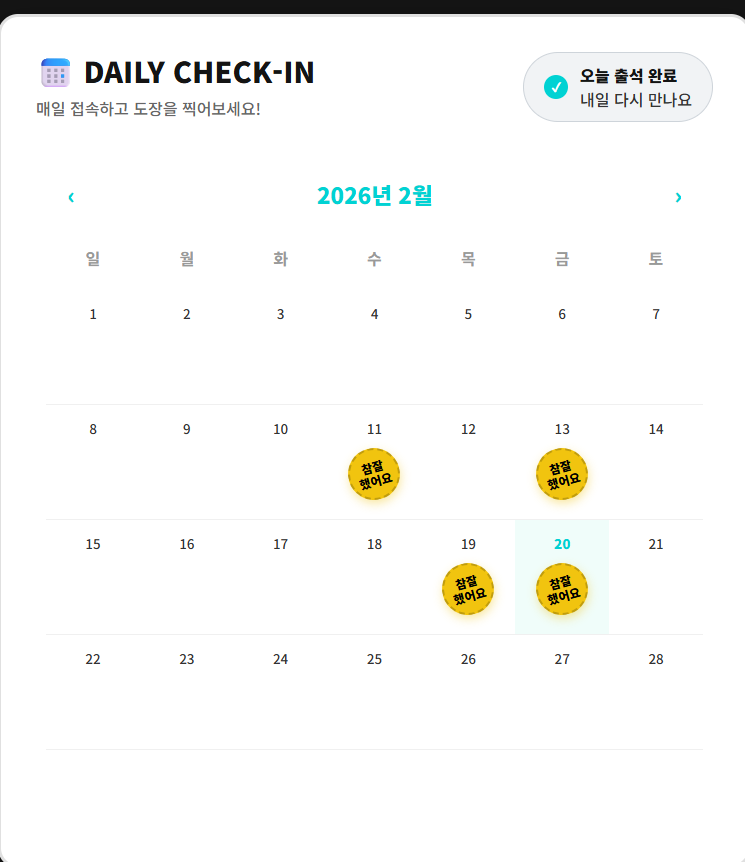
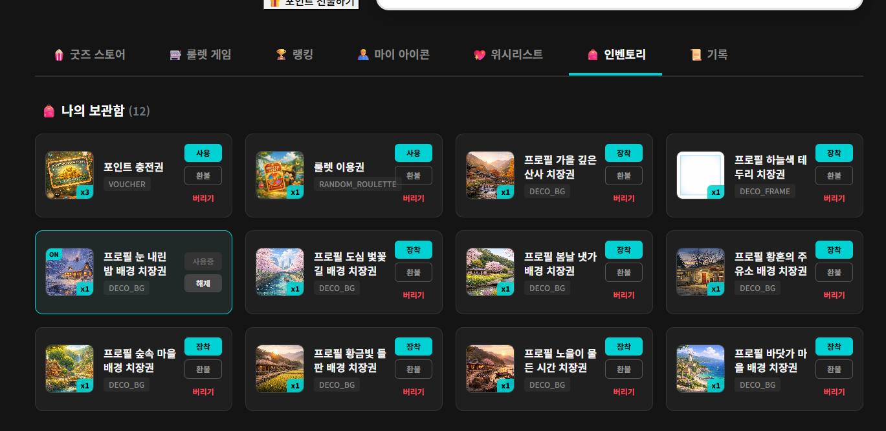
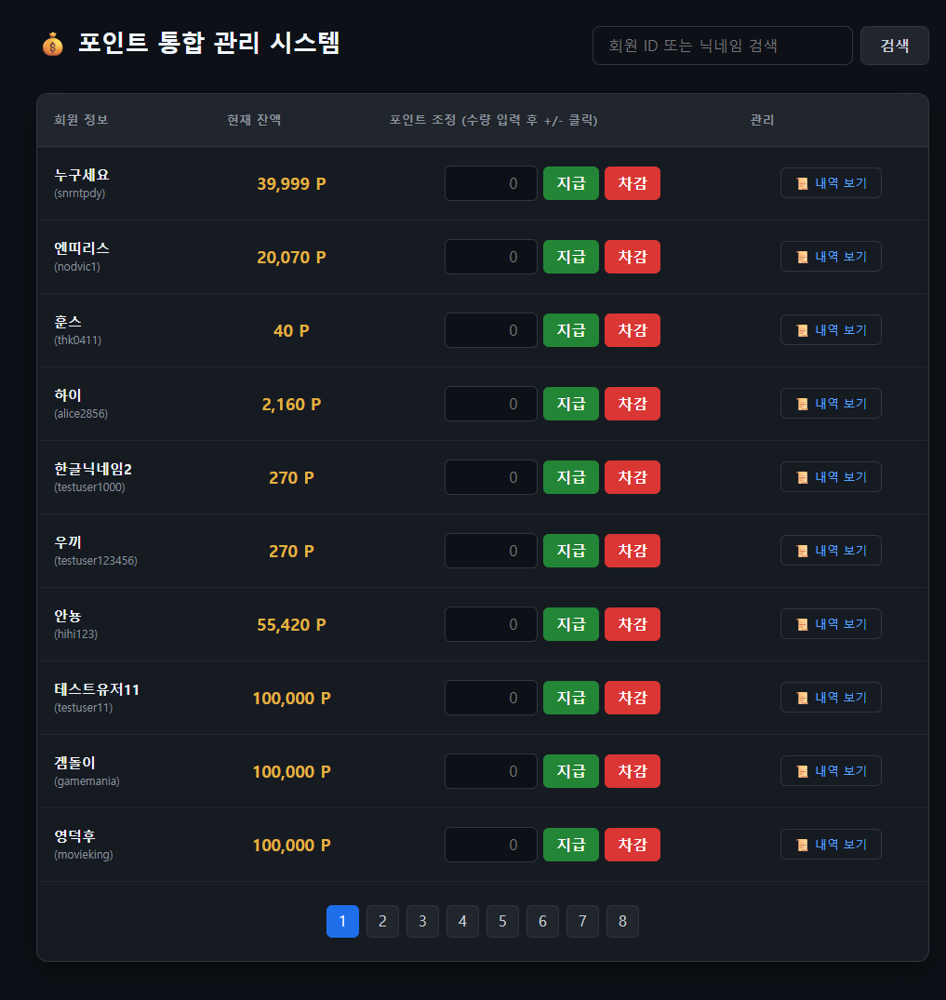

# Frontend (React) — Point Reward Platform

포인트 기반 보상 플랫폼의 프론트엔드입니다.

출석, 일일 퀘스트(퀴즈/룰렛), 포인트 상점, 위시리스트, 인벤토리(사용/장착/해제/환불), 포인트 이력 화면을 제공하고  
관리자 화면에서는 포인트 지급/차감, 상품 관리, 회원 자산 조회 등을 운영할 수 있습니다.

---

## Tech Stack

- React (Vite)
- React Router
- Axios (Interceptor 기반 인증 처리)
- Jotai (전역 상태 관리)

---

## Run

```bash
npm install
npm run dev
```

환경 변수

```bash
VITE_BASE_URL=http://localhost:8080
```

---

## 🏗 Architecture

| Architecture |
|---|
|  |

프로젝트는 기본적인 MVC 구조를 기준으로 API와 통신하도록 구성했습니다.

요청 흐름

Frontend → API 요청 → Backend → Database

Axios interceptor를 이용해 인증 처리와 재요청 로직을 관리했습니다.

---

## 📊 ERD

| ERD |
|---|
|  |

---

## 🧭 화면 흐름

| 메인 대시보드 | 출석 |
|---|---|
|  |  |

| 상점 | 인벤토리 |
|---|---|
|  |  |

| 포인트 이력 | 관리자 포인트 |
|---|---|
|  |  |

| 관리자 상점 | 관리자 자산 |
|---|---|
|  |  |

---

## Feature List

### User (16)

1. 출석 상태 조회  
2. 출석 체크  
3. 출석 캘린더 조회  
4. 일일 퀘스트 목록 조회  
5. 퀘스트 진행도 반영  
6. 퀘스트 보상 수령  
7. 데일리 퀴즈 랜덤 출제 (1일 1회)  
8. 퀴즈 정답 제출 및 검증  
9. 룰렛 실행 (티켓 소모 / 보상 처리)  
10. 상점 목록 조회 (검색 / 필터 / 페이징)  
11. 상품 구매 (포인트 차감 / 재고 / 인벤 반영)  
12. 선물하기 (상대 인벤토리 반영)  
13. 위시리스트 토글  
14. 내 위시리스트 조회  
15. 내 인벤토리 조회 (상품 정보 포함)  
16. 인벤 아이템 처리 (사용 / 장착 / 해제 / 환불)

---

### Admin (4)

1. 회원 포인트 지급 / 차감  
2. 포인트 처리 이력 조회  
3. 상점 상품 등록 / 수정 / 삭제 및 재고 관리  
4. 회원 인벤토리 조회 / 관리

---

## Docs

- `detail-front.md`

내용

- API 호출 흐름  
- 핵심 코드 설명  
- 트러블슈팅 기록
